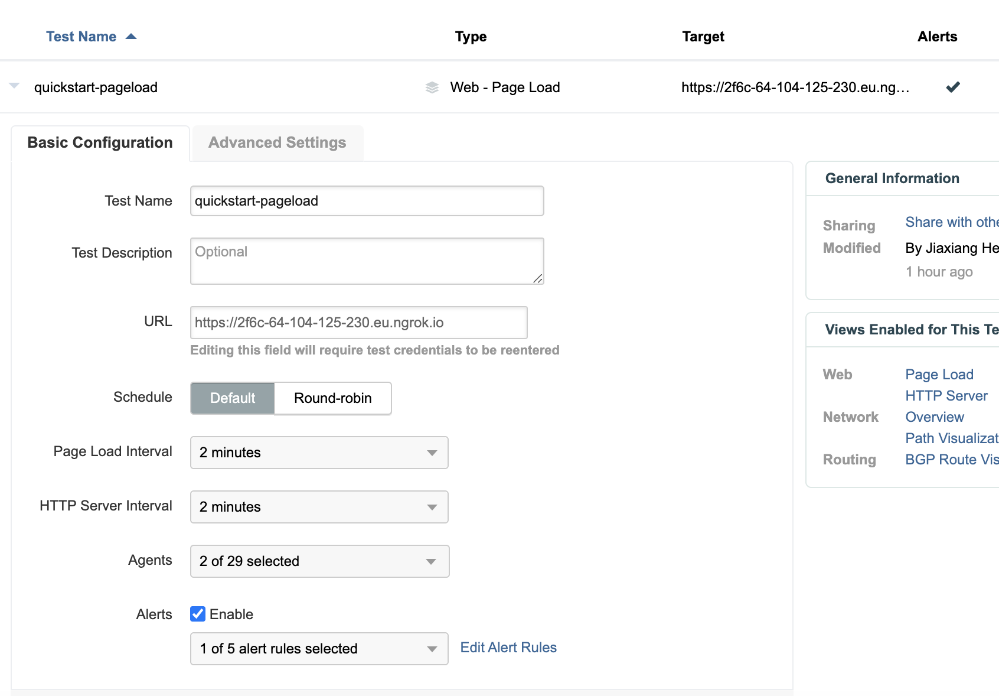

## ThousandEyes Operator
[](https://www.apache.org/licenses/LICENSE-2.0.html)
[](https://golang.org/)

ThousandEyes Operator is a Kubernetes operator used to manage ThousandEyes [Tests](https://developer.thousandeyes.com/v6/tests/) deployed via the Kubernetes cluster.
It is built using the [Operator SDK](https://github.com/operator-framework/operator-sdk), which is part of the [Operator Framework](https://github.com/operator-framework/).

The purpose of creating this operator is to provide an automate operation of ThousandEyes on Kubernetes.

## Documentation
* [Supported Test Types](#supported-test-types)
* [Prerequisites](#prerequisites)
* [Quick Start](#quick-start)
* [Advanced Usages](#advanced-usage)
  * [Define a Kubernetes Custom Resource](#define-a-kubernetes-custom-resource)
  * [Annotate a Kubernetes Ingress or Service resource](#annotate-a-kubernetes-ingress-or-service-resource)
* [Reference](#reference)

## Supported Test Types
ThousandEyes Operatator supports managing the following test types.
- HTTP Server Test
- Page Load Test
- Web Transacations Test

More types will be supported in the future.

## Prerequisites

ThousandEyes Operator requires a Kubernetes cluster of version `>=1.18.0`. If you have just started with Operators, it is highly recommended to use latest version of Kubernetes.

### Install ThousandEyes Operator

1. Clone the project
   ```
   git clone https://github.com/CiscoDevNet/thousandeyes-operator.git
   cd thousandeyes-operator
   ```

2. Get the Oauth Bearer Token from [ThousandEyes dashboard](https://app.thousandeyes.com/login)

   

3. Update the OAuth bearer token

   Encode the token in base64
   ```
   echo -n "YOUR_OAUTH_BEARER_TOKEN" | base64
   ```

   Modify OAuthBeaerToken (base64 encoded) in [thousandeyes_operator.yaml](./config/deploy/thousandeyes_operator.yaml#L7)

4. Install the operator
   ```
   kubectl apply -f config/deploy/thousandeyes_operator.yaml
   ```

5. Verify installation status

   i. Check ThousandEyes Operator pod status
   ```
   kubectl get pods | grep thousandeyes
   
     NAME                                                 READY   STATUS    RESTARTS   AGE
     devnet-thousandeyes-operator-564b5d75d-jllzk         1/1     Running   0          108s
   ```
   ii. Check ThousandEyes CRD status
   ```
   kubectl get crd | grep thousandeyes
   
     NAME                                                  CREATED AT
     annotationmonitorings.thousandeyes.devnet.cisco.com   2021-07-07T15:44:40Z
     httpservertests.thousandeyes.devnet.cisco.com         2021-07-07T15:44:41Z
     pageloadtests.thousandeyes.devnet.cisco.com           2021-07-07T15:44:42Z
     webtransactiontests.thousandeyes.devnet.cisco.com     2021-07-07T15:44:44Z 
   ```

## Quick Start

Let`s run an Nginx web app locally, then create a **Page Load** test to monitor this app.

### Run a basic Nginx Web App

1. Create an Nginx web app
   ```
   cd thousandeyes-operator
   kubectl apply -f config/samples/nginx.yaml
   ```
2. Check the Nginx pod status
   ```
    kubectl get pods -A | grep nginx
    default         nginx-6976ddb986-rxqv6                          1/1     Running     0          12s
   ```
3. Expose **Nginx service** to Internet Using [ngrok](https://ngrok.com/)
   ```
   kubectl apply -f config/samples/ngrok.yaml  
   ```
4. Get the public URL of this web app
   ```
   kubectl exec $(kubectl get pods -l=app=ngrok -o=jsonpath='{.items[0].metadata.name}') -- curl --silent  http://localhost:4040/api/tunnels | sed -nE 's/.*public_url":"([^"]*).*/\1/p'
   ```

5. Access this app

   Open your favorite browser and navigate to the public URL.
   You should see the Nginx welcome page which means you have run the app successfully.

### Create a Page Load Test
1. Update public URL in [pageload_cr.yaml](./config/samples/pageload_cr.yaml#L6)
2. Create the page load test CR
```
kubectl apply -f config/samples/pageload_cr.yaml
```
3. Go to ThousandEyes dashboard

   This test has been created on ThousandEyes dashboard.
   

## Advanced Usage
There are two ways to run ThousandEyes tests with ThousandEyes Operator:
1. [Create a Kubernetes Custom Resource](./docs/custom_resource.md)
2. [Annotate Kubernetes Ingress / Service](./docs/annotations.md)

## Reference
1. [ThousandEyes Getting Started](https://docs.thousandeyes.com/product-documentation/getting-started)
2. [ThousandEyes Test MetaData](https://developer.thousandeyes.com/v6/tests/#/test_metadata)


