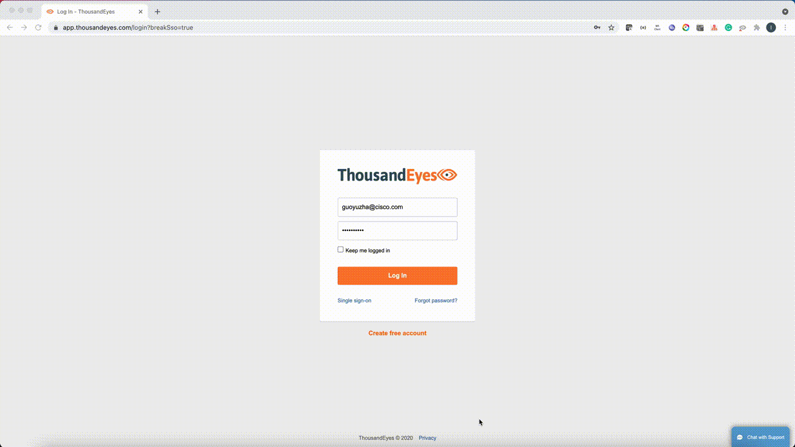

## ThousandEyes Operator
[](https://www.apache.org/licenses/LICENSE-2.0.html)
[](https://golang.org/)

ThousandEyes Operator is Kubernetes operator used to manage ThousandEyes [Tests](https://developer.thousandeyes.com/v6/tests/) deployed via the Kubernetes cluster.
It is built using the [Operator SDK](https://github.com/operator-framework/operator-sdk), which is part of the [Operator Framework](https://github.com/operator-framework/).

The purpose of creating this operator was to provide an easy operations of ThousandEyes on Kubernetes.

### Supported Features
This operatator supports creating, updating and deleting the following test types.
- HTTP Server Test
- Page Load Test 
- Web Transacation Test

### Prerequisites

ThousandEyes Operator requires a Kubernetes cluster of version `>=1.16.0`. If you have just started with Operators, it is highly recommended to use latest version of Kubernetes.

## Quick Start

### Install ThousandEyes Operator

1. Clone the project
   ```
   $ git clone https://github.com/CiscoDevNet/thousandeyes-operator.git
   $ cd thousandeyes-operator
   ```

2. Get the Oauth Bearer Token from [ThousandEyes dashboard](https://app.thousandeyes.com/login)

   

3. Update the OAuth Bearer Token

   Encode the token in base64
   ~~~
   $ echo -n "YOUR_OAUTH_BEARER_TOKEN" | base64
   WU9VUl9PQVVUSF9CRUFSRVJfVE9LRU4=
   ~~~

   Modify OAuthBeaerToken (base64 encoded) in [thousandeyes_operator.yaml](config/deploy/thousandeyes_operator.yaml#L7)

4. Install the operator
   ```
   $ kubectl apply -f config/deploy/thousandeyes_operator.yaml
   ```

5. Verify installation status

   i. Check the ThousandEyes Operator pod status
   ```
   $ kubectl get pods | grep thousandeyes
     NAME                                                 READY   STATUS    RESTARTS   AGE
     devnet-thousandeyes-operator-564b5d75d-jllzk         1/1     Running   0          108s
   ```
   ii. Check the ThousandEyes CRD status
   ```
   $ kubectl get crd | grep thousandeyes
     NAME                                                CREATED AT
     httpservertests.thousandeyes.devnet.cisco.com       2021-07-07T15:44:41Z
     pageloadtests.thousandeyes.devnet.cisco.com         2021-07-07T15:44:42Z
     webtransactiontests.thousandeyes.devnet.cisco.com   2021-07-07T15:44:44Z 
   ```

### Run a HTTP Server Test
1. Create a HTTP Server test
    ```
    $ kubectl apply -f config/samples/devnet_v1alpha1_httpservertest.yaml
    ```
2. Update the configuration of the HTTP Server test
  
   Modify the fields specified by [HTTP Server Test CR](./config/samples/devnet_v1alpha1_httpservertest.yaml) and redeploy.
    ```
    $ kubectl apply -f config/samples/devnet_v1alpha1_httpservertest.yaml
    ```
3. Delete the HTTP Server test
    ```
    $ kubectl delete -f config/samples/devnet_v1alpha1_httpservertest.yaml
    ```

### Run a Page Load Test
1. Create a Page Load test
    ```
    $ kubectl apply -f config/samples/devnet_v1alpha1_pageloadtest.yaml
    ```
2. Update the configuration of the Page Load test

   Modify the fields specified by [Page Load Test CR](./config/samples/devnet_v1alpha1_pageloadtest.yaml) and redeploy.
    ```
    $ kubectl apply -f config/samples/devnet_v1alpha1_pageloadtest.yaml
    ```
3. Delete the Page Load test
    ```
    $ kubectl delete -f config/samples/devnet_v1alpha1_pageloadtest.yaml
    ```

### Run a Web Transaction Test
1. Create a Web Transaction test
   ```
   $ kubectl apply -f config/samples/devnet_v1alpha1_webtransactiontest.yaml
   ```
2. Update the configuration of the Web Transaction test

   Modify the fields specified by [Web Transaction Test CR](./config/samples/devnet_v1alpha1_webtransactiontest.yaml) and redeploy
    ```
    $ kubectl apply -f config/samples/devnet_v1alpha1_webtransactiontest.yaml
    ```
3. Delete the Web Transaction test
    ```
    $ kubectl delete -f config/samples/devnet_v1alpha1_webtransactiontest.yaml
    ```

## References
1. [ThousandEyes Getting Started](https://docs.thousandeyes.com/product-documentation/getting-started)
2. [ThousandEyes Test MetaData](https://developer.thousandeyes.com/v6/tests/#/test_metadata)


